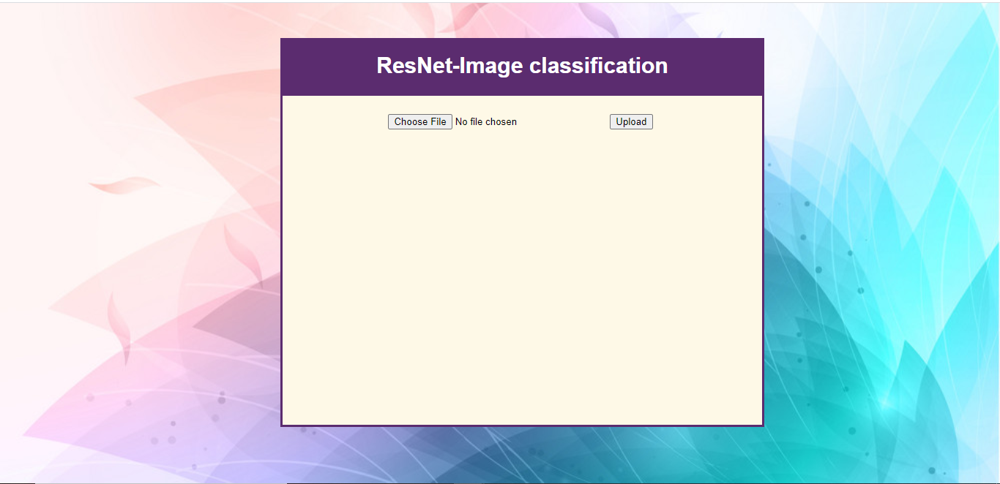
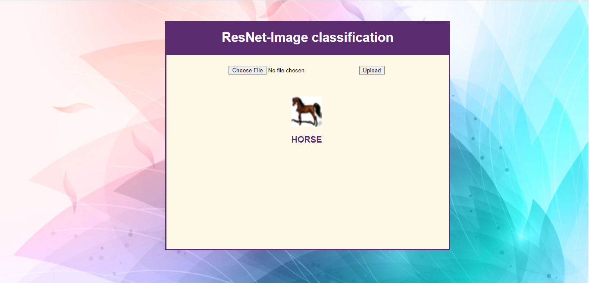

# ResNet-Deployment
- We have developed ResNet architecture and experimented with various Hyperparameters. Please checkout this repository for more details [Resnet_Implementation](https://github.com/ShrutiNair5/Resnet_Implementation) <- Click

- We are using ResNet Model [ResNet-18](https://github.com/ShrutiNair5/Resnet_Implementation/blob/master/Group5_ResNet/RESNET14_18_SGD.ipynb) where we achieved an accuracy of 91.07%. 

- The TrainingNotebook.ipynb was created as an abstraction to run the model and to save `training_logs.txt` and `saved_weights.pt` which are then used during inference.

- app.py file in the root directory of the folder structure which invokes [layout.html](https://github.com/ShrutiNair5/ResNet-Deployment/blob/master/ResNet-Deployment/templates/layout.html) from templates folder has a form to take one image from the user and on uploading redirects to [result.html](https://github.com/ShrutiNair5/ResNet-Deployment/blob/master/ResNet-Deployment/templates/result.html) displaying the image and the class that the image belongs to.

- After testing application on `localhost` we deployed it on Heroku platform

#### Steps required to deploy on Heroku platform
1)  Additional Files for Deployment- Before we deploy the web app, we need to create additional files in addition to Python files that we have created to build the app. These files are

-  requirements.txt: this is the text file that we need to create to tell Heroku to install the necessary Python packages needed to deploy our machine learning model. [requirements.txt](https://github.com/ShrutiNair5/ResNet-Deployment/blob/master/ResNet-Deployment/requirements.txt)

- Procfile: this is the file of your configuration to tell Heroku how and which files to be executed. [Procfile](https://github.com/ShrutiNair5/ResNet-Deployment/blob/master/ResNet-Deployment/Procfile)

2)  Create Your Heroku Account-
If you already have Heroku account, you can skip this step. If you haven’t, then you can directly go to Heroku. There you’ll find a ‘Sign Up’ button, click that button and fill the necessary information. After that, you need to confirm your new Heroku account with your E-Mail.

- Create a New app

- Name the app 

- Connect to Github

- Choose the Repo that we need to deploy

- Choose the Branch from which to deploy

- Click on Deploy Branch

- Turn on Automatic Deployment if needed
     

## Flask App

**Click here to checkout ResNet Deployment : [ResNet](https://resnetdeployment.herokuapp.com/)**   

## Group 5 Team members

- [Akshay Amrit](https://github.com/akshayamrit) - E20004
- [Aman Gupta](https://github.com/aman1608) - E20005
- [Prashantha Shivshankarrao](https://github.com/ksshaan) - E20022
- [Shivam Babbar](https://github.com/shivam9711) - E20032
- [Shruti Nair](https://github.com/ShrutiNair5) - E20033

